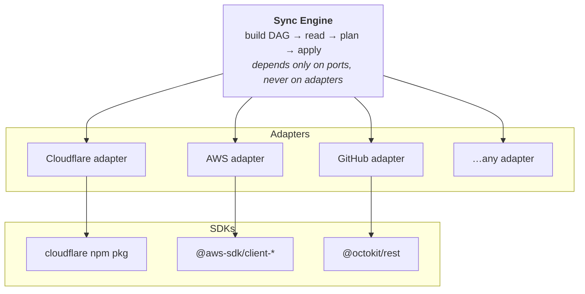
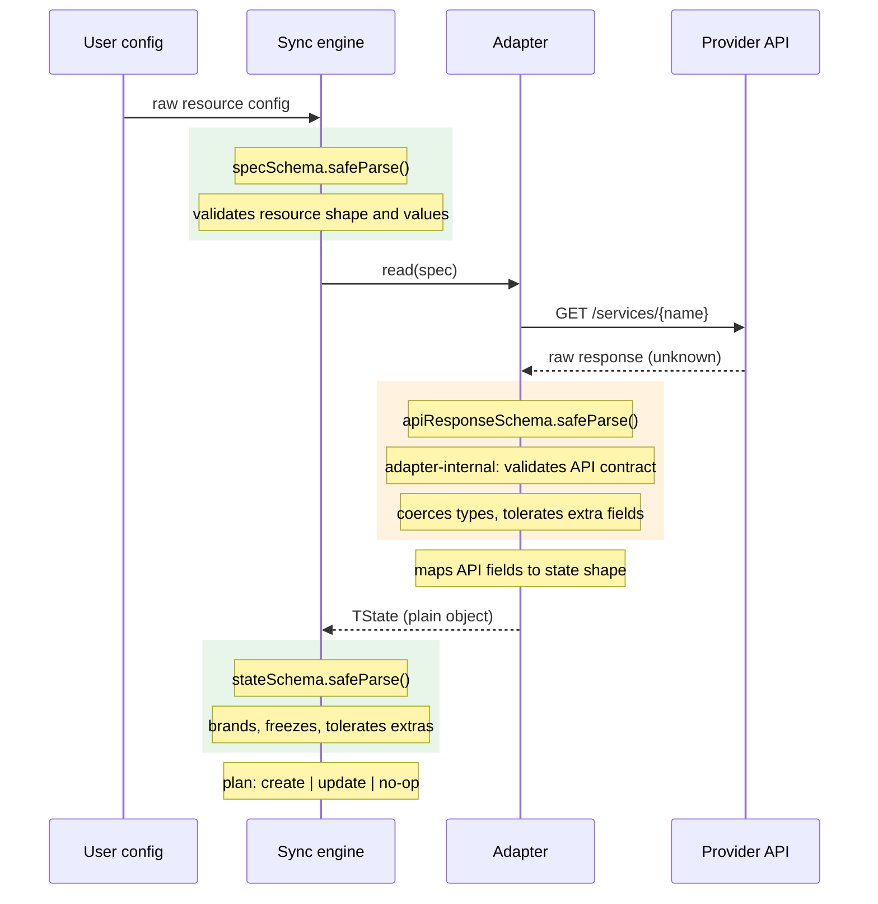
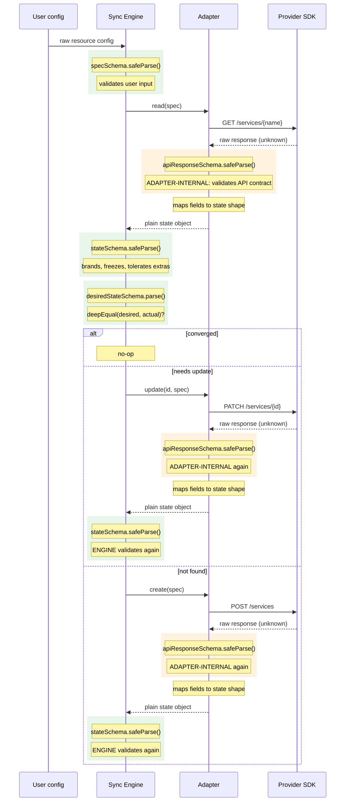
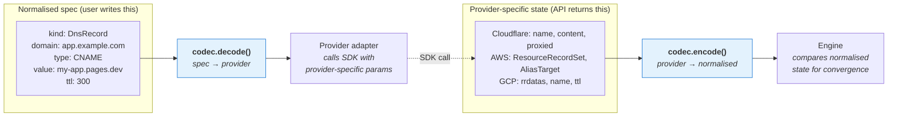

# InfraSync

Idempotent, deterministic, stateless infrastructure management for TypeScript — with equal functional and declarative authoring.

InfraSync is a TypeScript package and CLI for managing cloud infrastructure without a state file. Infrastructure can be authored with nested `Infra` scopes, declarative fragments, or any mixture of the two. Both forms compile to a serialisable `InfraIR`, then each run reads the current state from the provider, compares it against your desired configuration, and applies only the changes needed. No stored state to corrupt, no lock files to stale, no remote backend to configure.

An alternative to Terraform for teams who want infrastructure-as-code without the operational overhead of state management, while keeping both programmable and declarative styles first-class.

## Implementation Status

| Component | Status | Notes |
|-----------|--------|-------|
| IR types (Zod schemas) | ✅ Done | `InfraIR`, `ProviderInstanceIR`, `ResourceIR`, `RefTokenIR`, `RefBindingIR`, `SecretSourceIR` — canonical Zod schemas in `schemas.ts`, types inferred via `z.infer` |
| Core abstractions | ✅ Done | `ProviderPort`, `ResourcePort`, `ProviderAdapter`, `defineProvider()` |
| Ref system | ✅ Done | `RefToken<T>`, `refable()` (uses `z.xor()`), `RefBuilder<TRefs>` |
| Authoring API | ✅ Done | `defineInfra()`, `InfraScope`, `ProviderHandle`, `ResourceHandle` |
| Declarative fragments | ✅ Done | `declarative()` as first-class authoring unit |
| Compiler (authoring → IR) | ✅ Done | `compileToIR()`, ref serialisation, secret resolution |
| DAG builder | ✅ Done | Kahn's algorithm, DFS cycle detection, depth-level grouping |
| Sync engine | ✅ Done | Plan/apply, ref resolution, deep equality, convergence checking |
| Cloudflare provider | ✅ Done | DNS records, Access applications, Access policies, Identity providers, Pages custom domains |
| Typed provider handle | ✅ Done | `createCloudflareHandle()` with typed convenience methods |
| CLI | ✅ Done | `plan`, `apply`, `drift`, `fidelity`, `export cdktf-ts`, `export terraform-config`, `import terraform-config`, `import terraform-plan`, `import terraform-state`, `migrate` |
| Build pipeline | ✅ Done | tsdown with ESM + DTS, library and CLI entry points |
| Terraform IR types | ✅ Done | `@infrasync/core-ir` — TerraformIR Zod schemas, address parser, JSON Schema export |
| Fidelity reporting | ✅ Done | `@infrasync/core-fidelity` — `FidelityReportBuilder`, lossless/lossy/unsupported classification |
| TF state/plan import | ✅ Done | `@infrasync/adapter-terraform-show-json` — `importStateJson()`, `importPlanJson()` with fidelity reporting |
| CDKTF TypeScript export | ✅ Done | `export cdktf-ts` command generates reviewable CDKTF project from InfraIR |
| TF config JSON export | ✅ Done | `@infrasync/adapter-terraform-config-json` — `exportTfConfigJson()` with provider source registry |
| TF config JSON import | ✅ Done | `@infrasync/adapter-terraform-config-json` — `importTfConfigJson()` with fidelity reporting |
| TF config round-trip | ✅ Done | IR→TF→IR and TF→IR→TF guarantee tests with declared fidelity outcomes |
| TerraformIR → InfraIR bridge | ✅ Done | `@infrasync/adapter-terraform-show-json` — `convertToInfraIR()` maps TF providers → adapter names, snake_case → PascalCase, data sources → read mode, ref detection |
| TF-Config Cloudflare wiring | ✅ Done | `cloudflareResourceMappers` — DnsRecord ↔ `cloudflare_record` bidirectional spec mapping |
| Migration planner | ✅ Done | `@infrasync/migration-planner` — bidirectional diff engine, plugin system, safety classification, step generation |
| Destruction safety | ✅ Done | Lifecycle-aware mitigation: `create_before_destroy` → CBD, `prevent_destroy` → blocked, `replace_triggered_by` → forced CBD (overrides prevent_destroy), `ignore_changes` → filters diffs, DBC step pairs |
| Execution engine | ✅ Done | `executePlan()` — Kahn's dependency levelling, parallel step execution, InfraSync + Terraform targets, provider connection lifecycle |
| Fidelity command | ✅ Done | `infrasync fidelity --file adapter-result.json [--json]` |
| Migrate command | ✅ Done | `infrasync migrate` — unified pipeline with `--apply`, `--dry-run`, `--adapters` for plan-only or full execution |
| CI pipeline | ✅ Done | `.github/workflows/ci.yml` — typecheck + lint + test on push/PR |
| AWS provider | 🔲 Planned | — |
| GCP provider | 🔲 Planned | — |
| GitHub provider | 🔲 Planned | — |
| Vercel provider | 🔲 Planned | — |

## Why

Terraform's state file is its greatest strength and its greatest liability. State drift, corrupted state, lock contention, and the operational burden of remote backends are problems that stem from one design decision: storing a separate representation of reality alongside reality itself. InfraSync discards that. The provider API is the state.

The pattern emerged from a real project — a script that configured Cloudflare Access applications, identity providers, policies, DNS records, and custom domains. Every resource operation followed the same shape: list existing resources, match against desired configuration, create or update only what differs. That script is the blueprint for this tool.

## Design Principles

- **Stateless.** No state file, no lock file, no remote backend. The provider API is the source of truth.
- **Idempotent.** Running the same configuration twice produces the same result. Create-if-missing, update-if-changed, skip-if-matching.
- **Deterministic.** Given the same desired configuration and the same current state, the same plan is produced every time.
- **TypeScript-native.** Infrastructure is defined with full type safety. No HCL, no DSL, no template strings. Intellisense, refactoring, and type checking all work. Zod schemas are the single source of truth for every type — runtime validation and static types are always in sync.
- **Programmable first, CLI second.** The core is a library. The CLI is a thin wrapper that loads an infra file and invokes the programmatic API.
- **Equal authoring styles.** Infra can be authored functionally, declaratively, or as a mixture of both. These styles are first-class peers and fully interoperable.
- **Serialisable core.** All authoring compiles to `InfraIR`, a canonical intermediate representation the engine executes independent of the language frontend.
- **Provider-agnostic.** The sync engine knows nothing about Cloudflare, AWS, or GCP. Providers are adapters that implement a uniform interface over provider-specific APIs.

## Installation

```bash
pnpm add infrasync
```

## Authoring API

InfraSync exposes one authoring model with two equal forms: functional authoring with nested `Infra` scopes, and declarative authoring with fragments expressed as data.

### Functional and Declarative Authoring

Define infrastructure with nested `Infra` scopes, declarative fragments, or any mixture of the two. `defineInfra()` creates the root scope. `infra.infra()` creates child scopes. `declarative()` wraps a declarative fragment so it can participate in the same graph, outputs, refs, and provider instances as functionally authored infra.

```typescript
import {
	defineInfra,
	cloudflare as cloudflareAdapter,
	createCloudflareHandle,
} from "@infrasync/core/compiler";

const infra = defineInfra("prod", (infra) => {
	const cfBase = infra.provider("cf", cloudflareAdapter, {
		apiToken: infra.secret.env("CLOUDFLARE_API_TOKEN"),
		accountId: infra.secret.env("CLOUDFLARE_ACCOUNT_ID"),
	});

	// Typed handle — each method returns a ResourceHandle with typed refs
	const cf = createCloudflareHandle(
		cfBase.instanceKey,
		cfBase.adapterName,
		cfBase.register,
	);

	const dnsRecord = cf.dnsRecord("www", {
		kind: "DnsRecord",
		domain: "www.example.com",
		type: "CNAME",
		value: "target.example.com",
		ttl: 300,
		proxied: true,
	});

	const idp = cf.identityProvider("google", {
		kind: "IdentityProvider",
		name: "Google Workspace",
		type: "google-apps",
		config: { client_id: "xxx", client_secret: "yyy" },
	});

	const app = cf.accessApplication("app", {
		kind: "AccessApplication",
		domain: "app.example.com",
		name: "My App",
		sessionDuration: "24h",
		autoRedirectToIdentity: true,
	});

	// RefToken<string> — the engine resolves to the actual ID before execution
	cf.accessPolicy("appPolicy", {
		kind: "AccessPolicy",
		applicationId: app.ref.id,
		name: "Allow Team",
		decision: "allow",
		include: [{ email: { domain: "example.com" } }],
	});

	return {
		outputs: {
			recordName: dnsRecord.ref.name,
		},
	};
});

// Compile to IR for inspection or serialisation
const ir = infra.toIR();
```

### CLI

```bash
# Apply configuration from a TypeScript infra file
npx infrasync apply --config infra.config.ts

# Preview changes without applying
npx infrasync plan --config infra.config.ts

# Show current drift (diff between desired and actual state)
npx infrasync drift --config infra.config.ts

# Low-level path: apply a raw InfraIR document (requires adapters module)
npx infrasync apply --ir infra.ir.json --adapters ./adapters.ts

# Import Terraform config JSON into InfraIR
npx infrasync import terraform-config --file main.tf.json --out infra.ir.json

# Import Terraform state JSON (from terraform show -json)
npx infrasync import terraform-state --file state.json

# Import directly from a Terraform state file
npx infrasync import terraform-state --statefile terraform.tfstate

# Import Terraform plan JSON (from terraform show -json)
npx infrasync import terraform-plan --file plan.json

# Import directly from a binary Terraform plan file
npx infrasync import terraform-plan --planfile tfplan

# Export InfraIR as Terraform Configuration JSON
npx infrasync export terraform-config --config infra.config.ts --out generated.tf.json

# Generate a CDKTF TypeScript project from InfraIR
npx infrasync export cdktf-ts --ir infra.ir.json --out ./generated/cdktf

# Check adapter fidelity report
npx infrasync fidelity --file adapter-result.json
npx infrasync fidelity --file adapter-result.json --json

# Migrate from Terraform to InfraSync (unified pipeline)
npx infrasync migrate --statefile terraform.tfstate --config infra.config.ts --direction tf-to-infrasync
npx infrasync migrate --terraform-file resources.tf.json --infrasync-file infra.ir.json --direction infrasync-to-tf
npx infrasync migrate --planfile tfplan --ir infra.ir.json --direction tf-to-infrasync --json

# Execute a migration plan against real providers
npx infrasync migrate --statefile terraform.tfstate --config infra.config.ts --direction tf-to-infrasync --apply
npx infrasync migrate --statefile terraform.tfstate --adapters ./adapters.ts --direction tf-to-infrasync --apply

# Dry-run: show what migration would do without making changes
npx infrasync migrate --statefile terraform.tfstate --config infra.config.ts --direction tf-to-infrasync --apply --dry-run
```

The `export cdktf-ts` command generates a reviewable CDKTF scaffold using `addOverride` with translated Terraform JSON blocks. It is intended as a bootstrap path and may require manual refinement for provider/resource-specific semantics.

### Terraform Interoperability

InfraSync provides bidirectional interoperability with Terraform through two separate JSON lanes:

| Lane | Direction | Format | Purpose |
|------|-----------|--------|----------|
| **Execution** | IR ↔ `*.tf.json` | Terraform JSON Configuration | Export InfraIR as native Terraform config, import Terraform config into IR |
| **Analysis** | TF → IR only | `terraform show -json` | Import existing Terraform state/plan for analysis, drift detection, migration |

Both lanes produce fidelity reports classifying every translation as lossless, lossy, or unsupported. Round-trip guarantee tests validate structural equivalence in both directions (IR→TF→IR and TF→IR→TF).

The `TerraformIR → InfraIR` bridge converts Terraform resources into InfraSync's canonical IR by mapping providers to adapter names, converting snake_case kinds to PascalCase, promoting data sources to read-mode resources, flattening nested blocks, and detecting Terraform reference expressions.

### Migration Planner

The migration planner compares infrastructure as represented in Terraform against InfraSync, producing a structured plan of concrete steps to bring one or the other into alignment.

```bash
# Compare Terraform state against InfraSync config
infrasync migrate --statefile terraform.tfstate --config infra.config.ts --direction tf-to-infrasync

# Compare two IR files
infrasync migrate --terraform-file resources.tf.json --infrasync-file infra.ir.json --direction infrasync-to-tf --json

# Execute the plan against real providers
infrasync migrate --statefile terraform.tfstate --config infra.config.ts --direction tf-to-infrasync --apply

# Dry-run: show what would happen
infrasync migrate --statefile terraform.tfstate --config infra.config.ts --direction tf-to-infrasync --apply --dry-run
```

The planner uses an extensible plugin system:

- **Generic plugin** — default rules with identifier-suffix heuristics (fields ending in `_id`, `_name`, `arn` are destructive by default)
- **Cloudflare plugin** — provider-specific mappings (`cloudflare_record` ↔ `CloudflareRecord`) and safety rules with create-before-destroy mitigation for destructive changes

Every attribute change is classified as **safe**, **risky**, or **destructive**. Destructive changes are further annotated with mitigation strategies:

| Mitigation | Behaviour |
|------------|------------|
| `create-before-destroy` | Automated — new resource created before old is destroyed |
| `destroy-before-create` | Confirmation required — old resource destroyed first, then new created |
| `none` (from `prevent_destroy`) | Blocked — manual intervention required |
| `in-place-replace` | Automated — resource replaced without data loss |

Terraform lifecycle metadata is resolved in priority order (first match wins):

1. `replace_triggered_by` — forces CBD for **any** change to matching paths (even safe/risky). Overrides `prevent_destroy`.
2. `prevent_destroy: true` — blocks all automated replacement
3. `create_before_destroy: true` — promotes to automated CBD
4. Plugin rule mitigations — CBD if any rule requests it; in-place-replace if all destructive diffs support it
5. Default — destroy-before-create (not automated, requires confirmation)

`ignore_changes` filters matching attribute diffs before safety/mitigation computation.

### Execution Engine

The execution engine takes a migration plan and runs its steps against the target system:

```bash
# Plan + execute in one command
infrasync migrate --statefile terraform.tfstate --config infra.config.ts \
  --direction tf-to-infrasync --apply

# With explicit adapters module
infrasync migrate --statefile terraform.tfstate --adapters ./adapters.ts \
  --direction tf-to-infrasync --apply
```

**Step execution:**
- Steps are levelled by dependency (Kahn's algorithm) and executed in parallel within each level
- Failed dependencies automatically skip downstream steps
- `manual-intervention` steps are never auto-executed (always require confirmation)

**InfraSync-targeted steps** dispatch through `ProviderPort`/`ResourcePort` APIs (create, update, read for verify).

**Terraform-targeted steps** generate scoped `*.tf.json` and run `terraform init` + `terraform apply`.

**Provider connection** resolves `$secret.env` references, validates config, and connects SDK clients. Disconnect happens in a `finally` block after execution completes.

**Step outcomes:**

| Status | Meaning |
|--------|----------|
| `success` | Step executed successfully |
| `failed` | Step threw (error captured) |
| `skipped` | Dependency failed or user callback rejected |
| `requires-confirmation` | Manual-intervention step (never auto-executed) |

## Compilation and Execution

InfraSync operates in four phases. First the authoring API compiles nested `Infra` scopes and declarative fragments into `InfraIR`. Then the execution engine reads current state, plans changes, and applies them. Every resource goes through the read phase. Only resources in `"manage"` mode proceed to plan and apply.

### Authoring-time provider instances

Providers are first-class authoring objects created inside an `Infra` scope. Each instance configures one independent adapter with its own credentials and SDK client.

In the functional authoring API this README uses **camelCase ids** for provider instances, child infra scopes, and resources (`awsProd`, `platform`, `appBucket`). The IR itself is just data, so other frontends may choose different naming conventions, but the TypeScript surface should read like TypeScript.


```typescript
const awsProd = infra.provider("awsProd", aws, {
    region: "eu-west-1",
    credentials: {
        accessKeyId: infra.secret.env("AWS_PROD_ACCESS_KEY_ID"),
        secretAccessKey: infra.secret.env("AWS_PROD_SECRET_ACCESS_KEY"),
    },
});

const awsStaging = infra.provider("awsStaging", aws, {
    region: "us-east-1",
    credentials: {
        accessKeyId: infra.secret.env("AWS_STAGING_ACCESS_KEY_ID"),
        secretAccessKey: infra.secret.env("AWS_STAGING_SECRET_ACCESS_KEY"),
    },
});
```

**Instance key ≠ adapter type.** `"awsProd"` and `"awsStaging"` both use the AWS adapter, but they get independent SDK clients with separate credentials. Resources are created through the provider instance, so there is no stringly-typed `provider: "awsProd"` in normal authoring code:

```typescript
const bucket = awsProd.s3Bucket("appBucket", { ... });
awsStaging.dynamodbTable("sessions", { ... });
```

Cross-instance references work like any other — the compiled DAG resolves values across provider boundaries:

```typescript
const prodBucket = awsProd.s3Bucket("appBucket", { ... });
cf.dnsRecord("appDns", {
    domain: "app.example.com",
    type: "CNAME",
    value: prodBucket.ref.websiteEndpoint,
});
```

### Compilation to `InfraIR`

The public API is nested and compositional. The engine is not. Before any provider work begins, InfraSync compiles the authoring tree into a canonical, flat intermediate representation:

```typescript
type InfraIR = {
    name: string;
    providers: ProviderInstanceIR[];
    resources: ResourceIR[];
};
```

Nested `Infra` scopes, provider instances, functionally authored resources, and declarative fragments all compile to the same `InfraIR`. That shared target is what makes the design serialisable and future-proof for cross-language frontends.

### Execution engine: build the dependency graph

Before any provider API calls, the compiler scans every resource spec for symbolic refs and `dependsOn` declarations, then builds a directed acyclic graph (DAG). Each ref token creates an edge from the referenced resource to the referencing resource. Topological sort determines processing order — authoring order is irrelevant.

If the graph contains a cycle, the engine fails immediately with a clear error showing the cycle path.

### Execution engine: read

Resources are processed in topological order. For each resource, InfraSync resolves the provider instance key to the correct adapter, which calls the provider API to discover the current state. No local state file is consulted — the provider is the sole source of truth.

Read state is collected into a **state map** keyed by resource name. As each resource's state is stored, any symbolic refs in downstream resources that point to it are resolved with the concrete value. By the time a resource is processed, all of its dependencies have been read and their refs resolved.

### Execution engine: plan

For resources in `"manage"` mode only — the desired configuration is compared against the current state. A plan is generated containing:

- **Creates** — resources that exist in the desired config but not in the provider.
- **Updates** — resources that exist in both but have drifted from the desired config.
- **No-ops** — resources that already match the desired config.

Resources in `"read"` mode are skipped — no plan is generated for them.

Planning is deterministic: the same desired config and the same current state always produce the same plan.

### Execution engine: apply

The plan is executed in topological order. Each create or update is applied, and the resulting state is stored back into the state map so that dependent resources see the updated values. Results are reported per-resource with success/failure status.

### Resource Model

The functional authoring API is nested and object-oriented, but the canonical model is flat. After compilation each resource in `InfraIR` has a **mode** that controls whether the engine manages it or just reads it:

| Mode                 | Behaviour                                                                                        |
| -------------------- | ------------------------------------------------------------------------------------------------ |
| `"manage"` (default) | Read current state → plan changes → apply. Creates if missing, updates if drifted.               |
| `"read"`             | Read current state only. No plan, no apply. State is available for other resources to reference. |

There is no separate "data resource" type. A read-mode resource uses the same spec schema, the same provider adapter, and the same codecs as a managed resource. The only difference is the engine stops after reading.

Each compiled `ResourceIR` has:

| Property             | Description                                                                                                                      |
| -------------------- | -------------------------------------------------------------------------------------------------------------------------------- |
| `name`               | Unique identifier within the configuration. Used as the DAG node key and as the target for symbolic refs.                         |
| `provider`           | Which provider **instance** to route this resource to (e.g. `"awsProd"`, `"cfCompany"`, `"github"`)                             |
| `kind`               | The resource type within that provider (e.g. `DnsRecord`, `S3Bucket`, `Repository`)                                              |
| `mode`               | `"manage"` (default) or `"read"`                                                                                                 |
| `dependsOn`          | Optional explicit dependency edges — resources that must be processed before this one, even if no symbolic ref connects them.    |
| Identity fields      | Fields used to match against existing resources (e.g. `domain` for an app, `name` for a bucket)                                  |
| Desired state fields | Fields that should be enforced (e.g. `versioning` for a bucket, `content` for a DNS record). May contain symbolic refs.          |

InfraSync uses **identity fields** to find existing resources (not provider-assigned IDs — those are opaque and provider-specific). If a matching resource exists, its desired state fields are compared and updated only when drifted. If no match is found, the resource is created.

### Read-Mode Resources

Read-mode resources are InfraSync's equivalent of Terraform's data sources — but without a separate concept. Any resource can be read-only by setting `mode: "read"`. The engine queries the provider API, validates the response, and stores the state. Other resources can then reference that state via symbolic refs such as `bucket.ref.websiteEndpoint`.

#### Why a single resource type, not two

Terraform separates `resource` and `data` into distinct blocks with different syntax and semantics. This forces you to know upfront whether something is managed or queried, and it prevents you from changing your mind without rewriting the config.

InfraSync uses one type. The mode is a property, not a category. This means:

- The same schema, codec, and adapter handle both cases.
- You can switch a resource from `"read"` to `"manage"` by changing one field — no rewrite needed.
- Read-mode resources go through the same validation pipeline (`specSchema.safeParse()`, `stateSchema.safeParse()`) as managed resources.
- The state map is uniform — the engine doesn't need two different lookup mechanisms.

### Dependency Graph

InfraSync builds a **directed acyclic graph (DAG)** from the configuration. Processing order is derived from the graph topology, not from the array order of resources. You can organise your configuration in whatever order makes sense for readability — the engine determines the correct execution order.

#### Edge sources

Edges in the DAG come from two sources:

| Edge source     | Authoring syntax                                              | Creates attribute binding?                   |
| --------------- | ------------------------------------------------------------- | -------------------------------------------- |
| **Symbolic ref**| `resource.ref.path` inside any spec field                     | Yes — the resolved value flows into the spec |
| **`dependsOn`** | `dependsOn: [otherResource]` or an equivalent authoring helper | No — ordering only, no attribute binding     |

A symbolic ref creates both a dependency edge and an attribute binding. `dependsOn` creates only an edge — useful when there is no attribute reference but the provider API still requires ordering.

#### Type-safe references with `.ref`

The problem with string-based references is that TypeScript cannot verify either the path or the resolved type. InfraSync's public API avoids string paths entirely. Provider methods return typed resource handles, and each handle exposes a `.ref` namespace derived from the resource's state schema.

```typescript
import { defineInfra } from "@infrasync/core/compiler";
import { cloudflare } from "@infrasync/cloudflare";

const infra = defineInfra("media", (infra) => {
	const cf = infra.provider("cloudflare", cloudflare, {
		apiToken: infra.secret.env("CLOUDFLARE_API_TOKEN"),
	});

	const mediaBucket = awsProd.s3Bucket("mediaBucket", {
		mode: "read",
		bucketName: "my-media-bucket",
		region: "eu-west-2",
	});

	awsProd.s3BucketPolicy("mediaPolicy", {
		bucketName: "my-media-bucket",
		policy: {
			Effect: "Allow",
			Principal: "*",
			Action: "s3:GetObject",
			Resource: mediaBucket.ref.arn,
		},
		dependsOn: [mediaBucket],
	});

	cf.dnsRecord("mediaDns", {
		domain: "media.example.com",
		type: "CNAME",
		value: mediaBucket.ref.websiteEndpoint,
		ttl: 300,
		proxied: true,
	});
});
```

#### How the types work end-to-end

There are three layers of type safety for symbolic refs.

**1. The path is valid.** Property access on `.ref` is typed from the target resource's state schema:

```typescript
const bucket = awsProd.s3Bucket("bucket", { /* spec */ });

bucket.ref.websiteEndpoint;      // ✅ RefToken<string>
bucket.ref.encryption.kmsKeyId;  // ✅ RefToken<string>
bucket.ref.websitEndpoint;       // ❌ compile error — typo
bucket.ref.nonexistent;          // ❌ compile error — no such path
```

The public `.ref` API is SDK sugar. It compiles to an explicit symbolic token in `InfraIR`, for example:

```json
{
  "$ref": {
    "resource": "media.mediaBucket",
    "path": "websiteEndpoint"
  }
}
```

This keeps the authoring experience ergonomic while preserving a fully serialisable core model.

**2. The resolved type matches the consuming field.** The spec schema still uses `refable()` under the hood. `refable(z.string())` accepts both `string` and `RefToken<string>`, so the type checker rejects incompatible refs naturally:

```typescript
const dnsRecordSpecSchema = z.object({
	domain: z.string(),
	type: z.enum(["A", "AAAA", "CNAME", "MX", "TXT"]),
	value: refable(z.string()),
	ttl: refable(z.number()),
	proxied: z.boolean(),
});

// ✅ Compiles — websiteEndpoint resolves to string
cf.dnsRecord("app", {
	value: bucket.ref.websiteEndpoint,
});

// ❌ Compile error — versioning resolves to boolean, not string
cf.dnsRecord("bad", {
	value: bucket.ref.versioning,
});

// ❌ Compile error — proxied is plain boolean, not refable<boolean>
cf.dnsRecord("alsoBad", {
	proxied: bucket.ref.versioning,
});
```

**3. The engine resolves before validation.** At runtime the engine walks each compiled spec, replaces every `RefToken` with the concrete value from the state map, then validates the resolved spec:

```typescript
const resolved = resolveRefs(rawSpec, stateMap);
// bucket.ref.websiteEndpoint  →  "my-bucket.s3.amazonaws.com"

const specResult = handler.specSchema.safeParse(resolved);
if (!specResult.success) {
	continue;
}
const spec = specResult.data;
```

#### Which fields should use `refable()`?

Only fields whose values might come from another resource's state — ARNs, endpoints, IDs, URLs. Fields that users always set to a known value stay as plain schemas:

```typescript
const s3BucketPolicySpecSchema = z.object({
	bucketName: z.string(),
	policy: z.object({
		Effect: z.enum(["Allow", "Deny"]),
		Principal: z.string(),
		Action: z.string(),
		Resource: refable(z.string()),
	}),
});
```

#### Mixing declarative and functional authoring

Functionally authored infra and declarative fragments are equal participants in the same authoring model. Either style can create providers, resources, outputs, and refs that the other style consumes:

```typescript
const infra = defineInfra("prod", (infra) => {
	const awsProd = infra.provider("awsProd", aws, { region: "eu-west-2" });

	const bucket = awsProd.s3Bucket("appBucket", {
		bucketName: "my-bucket",
	});

	infra.use(
		declarative("ops", {
			resources: [
				{
					provider: "awsProd",
					kind: "DynamodbTable",
					name: "sessions",
					billingMode: "PAY_PER_REQUEST",
					hashKey: { name: "pk", type: "S" },
					sortKey: { name: "sk", type: "S" },
					pointInTimeRecovery: true,
				},
			],
		}),
	);

	return {
		outputs: {
			bucketArn: bucket.ref.arn,
		},
	};
});
```

Interoperability is symmetrical — functional authoring can consume declarative outputs, and declarative fragments can target provider instances and refs created in functionally authored infra.
#### How the compiler and engine build the DAG from handles

Builder methods like `awsProd.s3Bucket(...)` return internal resource handles. These are not the canonical execution format — they are compilation artefacts the SDK uses before emitting `InfraIR`.

```typescript
// The resource handle carries dependency identity during compilation

interface ResourceHandle<TSpec, TState> {
	/** Unique name — the DAG node key */
	readonly name: string;
	/** Provider instance key (e.g. "awsProd", "cfCompany") */
	readonly provider: string;
	readonly kind: string;
	readonly mode: "manage" | "read";
	readonly rawSpec: TSpec;

	/**
	 * Refs extracted from the spec at construction time.
	 * Each entry maps a spec field path to a [targetHandle, statePath] pair.
	 */
	readonly refs: ReadonlyMap<string, [ResourceHandle<any, any>, string]>;

	/** Handles listed in dependsOn */
	readonly explicitDeps: ReadonlySet<ResourceHandle<any, any>>;
}

function buildDag(
	resources: Array<ResourceHandle<any, any> | RawResource>,
): ResourceNode[] {
	const nodes = new Map<string, ResourceNode>();

	for (const resource of resources) {
		const isHandle = "name" in resource && "refs" in resource;
		const deps = new Set<string>();
		const refBindings = new Map<string, string>();

		if (isHandle) {
			// Edges from symbolic refs — already extracted, type-safe
			for (const [, [target, statePath]] of resource.refs) {
				deps.add(target.name);
			}
			// Edges from dependsOn — handle references, guaranteed to exist
			for (const dep of resource.explicitDeps) {
				deps.add(dep.name);
			}
		} else {
			// Declarative object — walk for ref tokens (untyped fallback)
			walkSpec(resource, (path, token) => {
				deps.add(token.target);
				refBindings.set(path, token.dotPath);
			});
		}

		nodes.set(resource.name, { /* ... */ });
	}

	// Validate, topological sort, return
}
```

Handles carry their dependency edges at construction time — the compiler does not need to walk functionally authored specs with string matching. Declarative fragments use a raw-spec walk because their structure is data rather than live handles, but they remain first-class citizens in the compiled graph.

#### Processing in topological order

```typescript
// Phases 1–3: Read → plan → apply in DAG order

const stateMap = new Map<string, unknown>();
const allIssues: { resource: string; issues: z.ZodIssue[] }[] = [];

for (const node of sortedNodes) {
	const handler = getHandler(node.providerInstance, node.kind);

	// 1. Resolve all symbolic ref tokens using the state map
	const resolvedSpec = resolveRefs(node.rawSpec, node.refBindings, stateMap);

	// 2. Validate the resolved spec against the schema
	const specResult = handler.specSchema.safeParse(resolvedSpec);
	if (!specResult.success) {
		allIssues.push({ resource: node.name, issues: specResult.error.issues });
		continue;
	}
	const spec = specResult.data;

	// 3. Read current state from the provider
	const rawState = await handler.read(spec);
	let state: z.infer<typeof handler.stateSchema> | undefined;
	if (rawState !== undefined) {
		const stateResult = handler.stateSchema.safeParse(rawState);
		if (!stateResult.success) {
			allIssues.push({ resource: node.name, issues: stateResult.error.issues });
			continue;
		}
		state = stateResult.data; // branded, readonly, coerced
	}

	stateMap.set(node.name, state);

	// 4. Plan and apply for managed resources only
	if (node.mode === "manage") {
		if (state === undefined) {
			const created = await handler.create(spec);
			const createdResult = handler.stateSchema.safeParse(created);
			if (!createdResult.success) {
				allIssues.push({ resource: node.name, issues: createdResult.error.issues });
				continue;
			}
			stateMap.set(node.name, createdResult.data);
		} else {
			const desired = handler.desiredStateSchema.parse(spec);
			const actual = handler.desiredStateSchema.parse(state);
			if (!deepEqual(desired, actual)) {
				const updated = await handler.update((state as any).id, spec);
				const updatedResult = handler.stateSchema.safeParse(updated);
				if (!updatedResult.success) {
					allIssues.push({ resource: node.name, issues: updatedResult.error.issues });
					continue;
				}
				stateMap.set(node.name, updatedResult.data);
			}
		}
	}
}

// Report all collected issues at once
if (allIssues.length > 0) {
	for (const { resource, issues } of allIssues) {
		for (const issue of issues) {
			console.error(`  ${resource}: ${issue.path.join(".")} — ${issue.message}`);
		}
	}
	process.exit(1);
}
```

#### Parallel processing

Resources at the same depth in the DAG have no dependencies between them and can be processed concurrently. For example, if three DNS records all depend on the same bucket but not on each other, all three can be read and applied in parallel after the bucket is processed.

```typescript
// Process by depth level for parallelism
const levels = groupByDepth(sortedNodes);

for (const level of levels) {
	await Promise.all(level.map((node) => processNode(node, stateMap)));
}
```

This gives you Terraform-style parallelism for free — the DAG tells you exactly which resources can safely run concurrently.

#### Declarative graph semantics across both authoring forms

Even though the public authoring API has both functional and declarative forms, the graph semantics remain declarative. You do not declare edges explicitly (though `dependsOn` is available for cases that need it). The graph emerges from the data flow:

1. Every symbolic ref is an edge: `target → this resource`.
2. Every entry in `dependsOn` is an edge: `dep → this resource`.
3. Resources with no refs and no `dependsOn` have no incoming edges — they are roots.
4. The topological sort produces a valid processing order.

This is the same approach Terraform uses (implicit edges from interpolation references), but expressed as a TypeScript function call rather than a string interpolation.

## Provider Adapters and Engine Architecture

InfraSync follows the **ports and adapters** pattern (hexagonal architecture). The sync engine is the core domain. It defines **ports** — interfaces that describe what it needs from the outside world — and each provider is an **adapter** that implements those ports for a specific platform. The engine never imports an AWS SDK, a Cloudflare SDK, or any provider-specific dependency. It only calls through the port interfaces.



### Why the engine consumes `InfraIR`

The engine does not execute either authoring form directly. The compiler normalises both into a flat, canonical intermediate representation:

```typescript
type InfraIR = {
	name: string;
	providers: ProviderInstanceIR[];
	resources: ResourceIR[];
};
```

This separation is deliberate:

- **SDK ergonomics.** TypeScript users get nested composition and property-based refs (`bucket.ref.websiteEndpoint`).
- **Serialisability.** The engine only consumes data, not live objects, Proxies, or closures.
- **Cross-language future.** Other frontends can target the same `InfraIR` without reimplementing engine semantics.
- **Interoperability.** Functional and declarative authoring remain interchangeable because they compile to the same representation.

### Zod as the Schema Backbone

Every type in InfraSync — resource specs, provider state, provider config — is defined as a **Zod schema**. Zod serves as the single source of truth: from each schema you get the TypeScript type (via `z.infer`), runtime validation (via `safeParse()`), and field introspection (via `.shape`). There are no separate interface definitions that could drift from the runtime validation logic.

This matters because InfraSync has two distinct validation boundaries:

1. **The adapter boundary** — the adapter receives `unknown` from a provider API and validates it against a private API response schema. This catches API contract violations (rate limit responses where objects were expected, missing fields, changed shapes) at the source, with full context about what the API actually returned.
2. **The engine boundary** — the engine validates the adapter's output against the public state schema. This is the safety net: even if an adapter has a bug, the engine catches malformed state before it enters the state map or gets compared for convergence.



#### What Zod provides

| Concern                   | Without Zod                         | With Zod                                                |
| ------------------------- | ----------------------------------- | ------------------------------------------------------- |
| **Type definitions**      | Separate `interface` declarations   | `z.infer<typeof schema>` — always in sync with runtime  |
| **Input validation**      | Manual guards or trust              | `safeParse()` at every boundary                         |
| **Error reporting**       | One error at a time                 | `safeParse()` collects all errors across all resources   |
| **Field introspection**   | String arrays that can drift        | `Object.keys(schema.shape)` — always matches the type   |
| **Convergence checking**  | Manual field-by-field comparison    | Pick desired-state sub-schema, compare parsed outputs   |
| **CLI config validation** | Fail at runtime with obscure errors | Fail fast with structured `ZodError` messages           |
| **Provider config**       | Trust user input                    | Validate credentials, regions, URLs at `connect()` time |
| **State immutability**    | Trust that nobody mutates the map   | `z.readonly()` freezes parsed state objects             |
| **State type safety**     | Could mix up bucket state with DNS  | `z.brand()` makes states nominally typed               |
| **API type mismatches**   | Adapter manually coerces strings    | `z.coerce` handles stringly-typed API responses         |
| **Config typos**          | Silently ignored extra fields       | `z.strictObject()` rejects unknown keys                 |
| **Extra API fields**      | Adapter strips unknown fields       | `z.looseObject()` passes them through                   |
| **Cross-field rules**     | Manual validation in adapter code   | `z.refine()` on the schema itself                       |
| **Documentation**         | Manually maintained                 | Generate JSON Schema from Zod for docs/IDE support       |

#### Schema design rules

InfraSync applies specific Zod features to each schema type for different guarantees:

| Schema type | Scope | Zod features | Why |
|-------------|-------|-------------|-----|
| **Config schemas** | Public | `z.strictObject()` | Reject typos in credential keys — `"apKey"` instead of `"apiKey"` should fail, not be silently ignored |
| **Spec schemas** | Public | `z.object()`, `z.default()`, `z.refine()`, `refable()`, string formats (`z.hostname()`, `z.url()`, `z.cidrv4()`) | Validate resource shape, fill provider defaults, enforce cross-field rules, accept symbolic refs |
| **State schemas** | Public | `z.looseObject()`, `z.coerce`, `z.brand()`, `z.readonly()` | Tolerate extra fields, coerce types, prevent type mix-ups, freeze against mutation |
| **API response schemas** | Adapter-internal | `z.looseObject()`, `z.coerce`, string formats (`z.iso.datetime()`, `z.uuid()`) | Validate raw API responses at the source, catch contract violations with full error context |

"Public" schemas are exposed on the `ResourcePort` and validated by the engine. "Adapter-internal" schemas live inside the adapter implementation — the engine never sees them.

The combination of `z.looseObject().brand().readonly()` on every state schema gives three guarantees with one parse call: extra API fields pass through, the type is nominally distinct from other resource states, and the result is frozen.

### Ports (the contracts)

The sync engine defines two ports: one for providers and one for individual resource kinds. Both are generic over Zod schemas, not raw TypeScript types.

#### `ProviderPort` — the provider-level interface

A provider adapter manages connection lifecycle and routes resource operations to the correct handler:

```typescript
import type { ZodType } from "zod";

interface ProviderPort<TConfig extends ZodType> {
	/** Unique name used in resource definitions (e.g. "cloudflare", "aws") */
	readonly name: string;

	/** Zod schema for this provider's configuration (credentials, region, etc.) */
	readonly configSchema: TConfig;

	/** Initialise the provider client (validate credentials, configure SDK) */
	connect(config: z.infer<TConfig>): Promise<void>;

	/** Gracefully close connections, release resources */
	disconnect(): Promise<void>;

	/** List all resource kinds this provider supports */
	supportedKinds(): string[];

	/** Route a resource operation to the correct handler for a given kind */
	resourceHandler(kind: string): ResourcePort;
}
```

The engine creates one `ProviderPort` instance per provider instance entry in `InfraIR`. Each instance calls `configSchema.safeParse(rawConfig)` before `connect()`. If validation fails, all issues are collected and reported before any API calls are made — the adapter never receives invalid config. Multiple entries with the same adapter type (e.g. `"awsProd"` and `"awsStaging"`) each get independent adapter instances with separate SDK clients.

#### `ResourcePort` — the resource-level interface

Each resource kind within a provider implements its own port. Spec and state are Zod schemas — the engine validates at every boundary:

```typescript
import type { ZodType, ZodObject } from "zod";

interface ResourcePort<
	TSpecSchema extends ZodType,
	TStateSchema extends ZodType,
> {
	/** The resource kind this handler manages (e.g. "DnsRecord", "S3Bucket") */
	readonly kind: string;

	/** Zod schema for the desired configuration of this resource */
	readonly specSchema: TSpecSchema;

	/** Zod schema for the current state returned by the provider API */
	readonly stateSchema: TStateSchema;

	/**
	 * Sub-schema containing only identity fields.
	 * Used by the engine to look up existing resources.
	 * Must be a subset of specSchema.
	 */
	readonly identitySchema: ZodObject<any>;

	/**
	 * Sub-schema containing only desired-state fields.
	 * Used by the engine for convergence checking.
	 * Must be a subset of specSchema.
	 */
	readonly desiredStateSchema: ZodObject<any>;

	/**
	 * Query the provider API for resources matching the identity fields in spec.
	 *
	 * Adapters validate the raw API response against a private apiResponseSchema
	 * (adapter-internal), then map fields into the shape expected by stateSchema.
	 * The engine then validates the return value through stateSchema.safeParse().
	 *
	 * Returns undefined if the resource does not exist.
	 */
	read(spec: z.infer<TSpecSchema>): Promise<z.infer<TStateSchema> | undefined>;

	/** Create a resource that does not yet exist */
	create(spec: z.infer<TSpecSchema>): Promise<z.infer<TStateSchema>>;

	/** Update an existing resource to match desired state */
	update(
		id: string,
		spec: z.infer<TSpecSchema>,
	): Promise<z.infer<TStateSchema>>;
}
```

Notice `isConverged()` is gone — the engine implements convergence generically by parsing both state and spec through `desiredStateSchema` and comparing the results. Adapters no longer need to write field-by-field comparison logic.

The adapter has **two validation responsibilities**:

1. **Validate raw API responses** against a private `apiResponseSchema` using `safeParse()`. This catches API contract violations at the source — the adapter author gets structured errors showing exactly which fields the API returned incorrectly. If validation fails, the adapter throws a `ProviderApiError` that the engine catches and adds to `allIssues`.
2. **Map fields** from the API response shape to the state schema shape. Every field access is typed because the API response was validated — no `as` casts needed.

The engine then validates the adapter's return value through `stateSchema.safeParse()` as a safety net. If the adapter has a mapping bug (wrong field, missing field), the engine catches it before the bad data enters the state map.

This two-layer approach means neither the adapter nor the engine trusts its input — each validates independently at its own boundary.

#### How the engine validates at boundaries

Validation happens at two boundaries: inside the adapter (raw API response) and inside the engine (adapter output).

**Adapter boundary** — validates raw API responses with a private schema:

```typescript
// Inside the adapter — the engine never sees this schema
const apiResponseSchema = z.looseObject({
	service_id: z.string(),
	service_name: z.string(),
	config: z.object({
		image: z.string(),
		replicas: z.coerce.number(),
		env_vars: z.record(z.string(), z.string()),
	}),
	state: z.enum(["running", "stopped", "deploying"]),
	created_at: z.iso.datetime(),   // extra field — not in state schema
	updated_at: z.iso.datetime(),   // extra field — not in state schema
});

async read(spec: ServiceSpec): Promise<ServiceState | undefined> {
	const response = await this.client.get(`/services/${spec.name}`);
	if (response.status === 404) return undefined;

	const raw = await response.json(); // unknown
	const result = apiResponseSchema.safeParse(raw);
	if (!result.success) {
		// API contract violation — structured error with field paths
		throw new ProviderApiError("internalPlatform", "read", result.error.issues);
	}
	const data = result.data; // fully typed, coerced, extra fields available

	// Map from API shape to state shape — every field access is typed
	return {
		id: data.service_id,
		name: data.service_name,
		image: data.config.image,
		replicas: data.config.replicas,
		env: data.config.env_vars,
		status: data.state,
	};
}
```

**Engine boundary** — validates adapter output with the public state schema:

```typescript
// Inside the sync engine — validates what the adapter returns

// 1. Validate user config against the spec schema
const specResult = resourceHandler.specSchema.safeParse(rawResource);
if (!specResult.success) {
	allIssues.push({ resource: rawResource.name, issues: specResult.error.issues });
	continue;
}
const spec = specResult.data;

// 2. Adapter reads current state (throws ProviderApiError on API contract violation)
let state: z.infer<typeof resourceHandler.stateSchema> | undefined;
try {
	const rawState = await resourceHandler.read(spec);
	if (rawState !== undefined) {
		// 3. Engine validates adapter output against the public state schema
		const stateResult = resourceHandler.stateSchema.safeParse(rawState);
		if (!stateResult.success) {
			// Adapter returned data that doesn't match the state contract
			allIssues.push({ resource: rawResource.name, issues: stateResult.error.issues });
			continue;
		}
		state = stateResult.data; // branded, readonly, coerced
	}
} catch (err) {
	if (err instanceof ProviderApiError) {
		allIssues.push({ resource: rawResource.name, issues: err.issues });
		continue;
	}
	throw err;
}

// 4. Engine checks convergence generically
if (state !== undefined) {
	const desired = resourceHandler.desiredStateSchema.parse(spec);
	const actual = resourceHandler.desiredStateSchema.parse(state);
	if (deepEqual(desired, actual)) {
		// no-op — resource is converged
	} else {
		// plan an update
	}
}
```

Why two layers? The adapter catches API contract violations (wrong shape, missing fields, type changes) with full context about what the API actually returned. The engine catches adapter bugs (wrong field mapping, missing fields) before bad data enters the state map. Neither trusts its input — each validates independently.

#### Data flow through the ports



### Codecs: Normalised Resource Specs Across Providers

Different providers often expose the same conceptual resource with different field names, shapes, and constraints. A DNS record on Cloudflare uses `name`/`content`/`proxied`. The same record on AWS Route53 uses `ResourceRecordSet` with `AliasTarget` or `ResourceRecords`. GCP Cloud DNS uses `rrdatas`/`name`/`ttl`. The resource is the same — the wire format is different.

Zod codecs solve this with **bidirectional transforms**. Each provider adapter defines a codec that translates between a normalised spec schema (shared across all providers for that resource kind) and the provider-specific state schema. The codec has two directions:

- **`decode(normalised) → provider-specific`** — before calling `create()`, `update()`, or `read()`, the engine transforms the user's normalised spec into the shape this provider expects.
- **`encode(provider-specific) → normalised`** — after `read()` returns provider-specific state, the engine transforms it back into the normalised shape so convergence checking can compare apples to apples.



#### Defining a normalised spec schema

A normalised schema is a plain Zod object schema shared across all providers for a given resource kind:

```typescript
// src/core/schemas/dns-record.ts
import { z } from "zod";

/** Normalised DNS record spec — works across Cloudflare, AWS, GCP */
export const dnsRecordSpecSchema = z
	.object({
		kind: z.literal("DnsRecord"),
		domain: z.hostname(), // identity field
		type: z.enum(["A", "AAAA", "CNAME", "MX", "TXT", "NS"]), // identity field
		value: z.string().min(1), // desired state field
		ttl: z.number().int().min(0).default(300), // desired state field (with default)
		proxied: z.boolean().default(false), // desired state field (ignored by providers that don't support it)
	})
	.refine(
		(spec) => {
			// CNAME cannot be at zone apex
			if (spec.type === "CNAME") {
				const parts = spec.domain.split(".");
				return spec.domain !== parts.slice(-2).join(".");
			}
			return true;
		},
		{ error: "CNAME records cannot be placed at the zone apex", path: ["type"] },
	);
export type DnsRecordSpec = z.infer<typeof dnsRecordSpecSchema>;

export const dnsRecordIdentitySchema = dnsRecordSpecSchema.pick({
	domain: true,
	type: true,
});

export const dnsRecordDesiredStateSchema = dnsRecordSpecSchema.pick({
	value: true,
	ttl: true,
	proxied: true,
});
```

#### Provider-specific codecs

Each provider defines a codec that maps between the normalised spec and its own API shape:

```typescript
// src/providers/cloudflare/dns-record-codec.ts
import { z } from "zod";
import { dnsRecordSpecSchema } from "@infrasync/core/dns-record";

/** Cloudflare's API shape for a DNS record.
 *  looseObject: tolerate extra fields like metadata, comment, tags.
 *  brand: prevent mix-ups with Route53 or GCP state.
 *  readonly: freeze after parsing.
 *  coerce: Cloudflare sometimes returns ttl as a string. */
const cloudflareDnsStateSchema = z
	.looseObject({
		id: z.string(),
		zone_id: z.string(),
		type: z.string(),
		name: z.string(),
		content: z.string(),
		proxied: z.coerce.boolean(),
		ttl: z.coerce.number(),
	})
	.brand<"CloudflareDnsState">()
	.readonly();

/** Codec: normalised ↔ Cloudflare */
export const cloudflareDnsCodec = z.codec(
	dnsRecordSpecSchema, // input schema: normalised spec
	cloudflareDnsStateSchema, // output schema: Cloudflare state
	{
		// Normalised → Cloudflare (used before create/update)
		decode: (spec) => ({
			type: spec.type,
			name: spec.domain,
			content: spec.value,
			ttl: spec.ttl,
			proxied: spec.proxied,
		}),

		// Cloudflare → normalised (used after read, for convergence checking)
		encode: (state) => ({
			kind: "DnsRecord" as const,
			domain: state.name,
			type: state.type as DnsRecordSpec["type"],
			value: state.content,
			ttl: state.ttl,
			proxied: state.proxied,
		}),
	},
);
```

```typescript
// src/providers/aws/route53-record-codec.ts
import { z } from "zod";
import { dnsRecordSpecSchema } from "@infrasync/core/dns-record";

/** AWS Route53's API shape for a resource record set.
 *  looseObject: Route53 returns many fields we don't model.
 *  brand: prevents passing this where Cloudflare state is expected. */
const route53RecordStateSchema = z
	.looseObject({
		Name: z.string(),
		Type: z.string(),
		TTL: z.coerce.number().optional(),
		ResourceRecords: z.array(z.object({ Value: z.string() })).optional(),
		AliasTarget: z.object({ DNSName: z.string() }).optional(),
	})
	.brand<"Route53DnsState">()
	.readonly();

/** Codec: normalised ↔ AWS Route53 */
export const route53DnsCodec = z.codec(
	dnsRecordSpecSchema,
	route53RecordStateSchema,
	{
		decode: (spec) => ({
			Name: `${spec.domain}.`, // Route53 requires trailing dot
			Type: spec.type,
			TTL: spec.ttl,
			ResourceRecords: [{ Value: spec.value }],
		}),

		encode: (state) => ({
			kind: "DnsRecord" as const,
			domain: state.Name.replace(/\.$/, ""), // strip trailing dot
			type: state.Type as DnsRecordSpec["type"],
			value:
				state.ResourceRecords?.[0]?.Value ?? state.AliasTarget?.DNSName ?? "",
			ttl: state.TTL ?? 300,
			proxied: false, // Route53 has no proxy concept
		}),
	},
);
```

#### Using the codec in the ResourcePort

The `ResourcePort` uses the codec's `decode` direction to transform specs before calling the SDK, and the engine uses `encode` to normalise state for convergence checking:

```typescript
// src/providers/cloudflare/dns-record.ts
import type { ResourcePort } from "@infrasync/core/provider";
import {
	dnsRecordSpecSchema,
	dnsRecordIdentitySchema,
	dnsRecordDesiredStateSchema,
} from "@infrasync/core/dns-record";
import { cloudflareDnsCodec } from "./dns-record-codec";
import type { DnsRecordSpec } from "@infrasync/core/dns-record";

export class CloudflareDnsRecord implements ResourcePort<
	typeof dnsRecordSpecSchema,
	typeof cloudflareDnsCodec._output
> {
	readonly kind = "DnsRecord";
	readonly specSchema = dnsRecordSpecSchema;
	readonly stateSchema = cloudflareDnsCodec._output; // Cloudflare-specific state schema
	readonly identitySchema = dnsRecordIdentitySchema;
	readonly desiredStateSchema = dnsRecordDesiredStateSchema;
	readonly codec = cloudflareDnsCodec;

	constructor(private client: Cloudflare) {}

	async read(spec: DnsRecordSpec) {
		// codec.decode transforms normalised spec into Cloudflare lookup params
		const cfParams = this.codec.decode(spec);
		const zone = await this.client.zones.list({
			name: extractZone(spec.domain),
		});
		const records = await this.client.dns.records.list({
			zone_id: zone.result[0].id,
			type: cfParams.type as any,
			name: { exact: cfParams.name },
		});
		return records.result[0]; // raw Cloudflare state — engine will encode() it back
	}

	async create(spec: DnsRecordSpec) {
		const cfParams = this.codec.decode(spec);
		const zone = await this.client.zones.list({
			name: extractZone(spec.domain),
		});
		return this.client.dns.records.create({
			zone_id: zone.result[0].id,
			...cfParams,
		});
	}

	async update(id: string, spec: DnsRecordSpec) {
		const cfParams = this.codec.decode(spec);
		const zone = await this.client.zones.list({
			name: extractZone(spec.domain),
		});
		return this.client.dns.records.update(id, {
			zone_id: zone.result[0].id,
			...cfParams,
		});
	}
}
```

#### The user writes one spec, targets any provider

```typescript
const infra = defineInfra("dns", (infra) => {
  const cf = infra.provider("cloudflare", cloudflare, {
    apiToken: infra.secret.env("CLOUDFLARE_API_TOKEN"),
  });
  const awsProd = infra.provider("awsProd", aws, {
    region: "eu-west-2",
    credentials: { ... },
  });

  // Same spec shape — only the provider instance changes
  cf.dnsRecord("appDns", {
    domain: "app.example.com",
    type: "CNAME",
    value: "my-app.pages.dev",
    ttl: 300,
    proxied: true,               // Cloudflare-specific, ignored by AWS codec
  });

  awsProd.dnsRecord("apiDns", {
    domain: "api.example.com",
    type: "CNAME",
    value: "my-bucket.s3.amazonaws.com",
    ttl: 60,
    // proxied omitted — codec defaults to false
  });
});
```

The engine decodes each spec through the target provider's codec before calling `read`/`create`/`update`, and encodes the state back for convergence checking. Provider-specific fields (like Cloudflare's `proxied`) are preserved in the normalised spec — codecs for providers that don't support them simply ignore them during `decode` and supply a default during `encode`.

#### What codecs buy you

| Without codecs                                                                        | With codecs                                                                    |
| ------------------------------------------------------------------------------------- | ------------------------------------------------------------------------------ |
| Each provider defines its own spec schema — different field names, different shapes   | One normalised spec schema per resource kind, shared across all providers      |
| Switching providers means rewriting resource specs                                    | Change `provider: "cloudflare"` to `provider: "awsProd"` — the spec stays the same |
| Convergence checking must handle provider-specific shapes                             | Engine compares normalised state, so convergence logic is provider-agnostic    |
| Provider-specific quirks (trailing dots, different enum values) leak into user config | Codecs absorb quirks — user writes clean, normalised values                    |

#### When not to use codecs

Not every resource kind benefits from normalisation. Some resources are provider-specific by nature — Cloudflare Access policies or AWS IAM roles have no equivalent on other providers. For these, the adapter defines its own `specSchema` without a codec. The codec layer is opt-in: normalise where it adds value, leave provider-specific resources in their native shape.

### Adapters (the implementations)

Adapters are concrete implementations of the ports for a specific provider. Each adapter:

1. Depends on the provider's npm SDK package.
2. Implements `ProviderPort` with `connect()` initialising the SDK client.
3. Implements `ResourcePort` for each supported resource kind, translating between InfraSync's spec types and the provider SDK's request/response types.
4. Handles provider-specific concerns: pagination, rate limiting, error mapping, retry logic.

Adapters live in `src/providers/<name>/` and are registered with the sync engine at configuration time. They are the only part of the codebase that imports provider SDKs.

### Built-in Providers

| Provider       | Status  | npm Package                                                                                                                                                                | Resource Kinds                                                                                                                                               |
| -------------- | ------- | -------------------------------------------------------------------------------------------------------------------------------------------------------------------------- | ------------------------------------------------------------------------------------------------------------------------------------------------------------ |
| **Cloudflare** | Initial | [`cloudflare`](https://www.npmjs.com/package/cloudflare) — official TypeScript SDK, v5.x, ~1M weekly downloads                                                             | `DnsRecord`, `AccessApplication`, `AccessPolicy`, `IdentityProvider`, `PagesCustomDomain`                                                                    |
| **AWS**        | Planned | [`@aws-sdk/client-*`](https://www.npmjs.com/package/@aws-sdk/client-s3) — official modular SDK, one package per service, v3.x, ~25M weekly downloads                       | `S3Bucket`, `DynamodbTable`, `LambdaFunction`, `IamRole`, `IamPolicy`, `CloudFrontDistribution`, `Route53Record`, `Ec2SecurityGroup`, `SnsTopic`, `SqsQueue` |
| **GCP**        | Planned | [`@google-cloud/*`](https://www.npmjs.com/package/@google-cloud/storage) — official client libraries, one package per service, v7.x, ~9M weekly downloads                  | `StorageBucket`, `CloudFunction`, `IamServiceAccount`, `DnsRecordSet`, `PubSubTopic`, `CloudRunService`                                                      |
| **GitHub**     | Planned | [`@octokit/rest`](https://www.npmjs.com/package/@octokit/rest) — official GitHub REST API client, v22.x, ~14M weekly downloads                                             | `Repository`, `BranchProtection`, `Team`, `TeamRepository`, `ActionsSecret`                                                                                  |
| **Vercel**     | Planned | [`@vercel/sdk`](https://www.npmjs.com/package/@vercel/sdk) — official type-safe TypeScript SDK (beta), v1.x, covers projects, domains, env vars, DNS, deployments          | `Project`, `Domain`, `EnvironmentVariable`                                                                                                                   |
| **Supabase**   | Planned | [`supabase-management-js`](https://www.npmjs.com/package/supabase-management-js) — community-maintained under `supabase-community`, auto-generated from OpenAPI spec, v2.x | `Project`, `Database`, `AuthConfig`                                                                                                                          |

Built-in providers may expose rich typed convenience methods such as `awsProd.s3Bucket(...)` or `cf.dnsRecord(...)`. Custom providers should assume only the generic baseline API: `provider.resource(kind, id, spec)`. Rich typed helpers for custom providers can be layered on later, but the generic form is the stable contract.

### Writing a Custom Provider

Any team can write a provider adapter for an internal platform or a service not yet supported. You define Zod schemas for your config, spec, and state types, implement the two ports, then pass the adapter object to `infra.provider(...)`. The functional authoring API can immediately use the generic `provider.resource(kind, id, spec)` form.

#### 1. Define Zod schemas for config, spec, and state

Zod schemas are the single source of truth. TypeScript types are inferred from them — no separate `interface` declarations needed.

```typescript
// schemas.ts
import { z } from "zod";

/** Provider configuration — validated at connect() time */
export const configSchema = z.object({
	baseUrl: z.url(),
	apiKey: z.string().min(1),
});
export type InternalPlatformConfig = z.infer<typeof configSchema>;

/** Desired configuration for a Service resource */
export const serviceSpecSchema = z.object({
	name: z.string().min(1), // identity field
	image: z.string().min(1), // desired state field
	replicas: z.number().int().min(1).max(100), // desired state field
	env: z.record(z.string(), z.string()), // desired state field
});
export type ServiceSpec = z.infer<typeof serviceSpecSchema>;

/** Current state returned by the provider API */
export const serviceStateSchema = z.object({
	id: z.string().uuid(),
	name: z.string(),
	image: z.string(),
	replicas: z.number(),
	env: z.record(z.string(), z.string()),
	status: z.enum(["running", "stopped", "deploying"]),
});
export type ServiceState = z.infer<typeof serviceStateSchema>;

/** Identity sub-schema — picks only the fields used for resource lookup */
export const serviceIdentitySchema = serviceSpecSchema.pick({ name: true });

/** Desired state sub-schema — picks only the fields the engine should enforce */
export const serviceDesiredStateSchema = serviceSpecSchema.pick({
	image: true,
	replicas: true,
	env: true,
});
```

Why `.pick()` for identity and desired state? The engine needs to know which fields identify a resource versus which fields it should enforce. `.pick()` produces a sub-schema whose shape is guaranteed to be a subset of `specSchema` — it cannot drift from the spec definition.

#### 2. Implement the `ResourcePort`

```typescript
// service-resource.ts
import type { ResourcePort } from "@infrasync/core/provider";
import {
	serviceSpecSchema,
	serviceStateSchema,
	serviceIdentitySchema,
	serviceDesiredStateSchema,
} from "./schemas";
import type { ServiceSpec, ServiceState } from "./schemas";

export class ServiceResource implements ResourcePort<
	typeof serviceSpecSchema,
	typeof serviceStateSchema
> {
	readonly kind = "Service";
	readonly specSchema = serviceSpecSchema;
	readonly stateSchema = serviceStateSchema;
	readonly identitySchema = serviceIdentitySchema;
	readonly desiredStateSchema = serviceDesiredStateSchema;

	constructor(private client: InternalPlatformClient) {}

	async read(spec: ServiceSpec): Promise<ServiceState | undefined> {
		const response = await this.client.get(`/services/${spec.name}`);
		if (response.status === 404) return undefined;
		// stateSchema.safeParse() is called by the engine — no need to validate here
		return response.json() as Promise<ServiceState>;
	}

	async create(spec: ServiceSpec): Promise<ServiceState> {
		const response = await this.client.post("/services", {
			body: JSON.stringify(spec),
		});
		return response.json() as Promise<ServiceState>;
	}

	async update(id: string, spec: ServiceSpec): Promise<ServiceState> {
		const response = await this.client.patch(`/services/${id}`, {
			body: JSON.stringify(spec),
		});
		return response.json() as Promise<ServiceState>;
	}

	// No isConverged() needed — the engine compares desiredStateSchema fields
	// generically using deep equality.
}
```

#### 3. Implement the `ProviderPort`

```typescript
// index.ts
import { defineProvider } from "@infrasync/core/provider";
import type { ProviderPort } from "@infrasync/core/provider";
import { configSchema } from "./schemas";
import type { InternalPlatformConfig } from "./schemas";
import { ServiceResource } from "./service-resource";
import { InternalPlatformClient } from "./client";

export const internalPlatformProvider = defineProvider<typeof configSchema>({
	name: "internalPlatform",
	configSchema,

	client: undefined as InternalPlatformClient | undefined,

	async connect(config: InternalPlatformConfig) {
		// config has already been validated by configSchema.safeParse()
		this.client = new InternalPlatformClient(config.baseUrl, config.apiKey);
		await this.client.get("/health");
	},

	async disconnect() {
		this.client = undefined;
	},

	supportedKinds() {
		return ["Service"];
	},

	resourceHandler(kind: string) {
		if (kind === "Service") return new ServiceResource(this.client!);
		throw new Error(`Unsupported resource kind: ${kind}`);
	},
});
```

#### 4. Register and use

```typescript
import { defineInfra } from "@infrasync/core/compiler";
import { internalPlatformProvider } from "./providers/internal-platform";

const infra = defineInfra("internal", (infra) => {
	const platform = infra.provider("internalPlatform", internalPlatformProvider, {
		baseUrl: "https://infra.internal",
		apiKey: infra.secret.env("INTERNAL_API_KEY"),
	});

	platform.resource("Service", "billingApi", {
		image: "registry.internal/billing-api:latest",
		replicas: 3,
		env: { NODE_ENV: "production", PORT: "3000" },
	});
});
```

At runtime, the engine:

1. `safeParse()`s the raw config through `configSchema` before calling `connect()`. Each provider instance gets its own adapter and client — `"awsProd"` and `"awsStaging"` each receive independent SDK clients with separate credentials. All issues are collected across all resources before reporting.
2. `safeParse()`s each resource through `specSchema` before calling `read()`, `create()`, or `update()`. Refinements and defaults are applied.
3. `safeParse()`s each API response through `stateSchema`. Extra fields pass through (loose), values are coerced (string → number), the result is branded and frozen.
4. Compares `desiredStateSchema.parse(spec)` against `desiredStateSchema.parse(state)` for convergence.

If any safeParse fails, the engine produces structured errors with exact field paths — no silent failures, no `as` casts hiding mismatches, no one-at-a-time error reporting.

#### Checklist for new providers

- [ ] Define Zod schemas (single source of truth for types and validation):
  - [ ] `configSchema` — `z.strictObject()` for credentials, base URL, region, etc. Rejects unknown keys.
  - [ ] `specSchema` — `z.object()` with `z.default()` for optional fields, `z.refine()` for cross-field rules, `refable()` for fields that accept symbolic refs, string formats (`z.hostname()`, `z.url()`, `z.cidrv4()`) where appropriate
  - [ ] `stateSchema` — `z.looseObject().brand().readonly()` with `z.coerce` for stringly-typed fields. Tolerates extra API fields, prevents type mix-ups, freezes against mutation.
  - [ ] `identitySchema` — `specSchema.pick({ ... })` with identity fields only
  - [ ] `desiredStateSchema` — `specSchema.pick({ ... })` with desired-state fields only
- [ ] Implement `ResourcePort` for each kind:
  - [ ] Expose the schemas as readonly properties
  - [ ] `read()` — query the API, return `undefined` if not found
  - [ ] `create()` — provision a new resource
  - [ ] `update()` — modify an existing resource
  - [ ] No `isConverged()` needed — the engine does this generically
- [ ] Implement `ProviderPort`:
  - [ ] Expose `configSchema`
  - [ ] `connect()` — initialise SDK client, validate credentials
  - [ ] `disconnect()` — clean up resources
  - [ ] `supportedKinds()` — list resource kind strings
  - [ ] `resourceHandler()` — route kind string to the correct `ResourcePort`
- [ ] Handle provider-specific concerns: pagination, rate limiting, error mapping
- [ ] Register the provider by passing the adapter object to `infra.provider("instanceId", adapter, config)`
- [ ] Use `provider.resource(kind, id, spec)` as the baseline functional authoring API for custom providers; typed convenience methods are optional sugar

## Comparison with Terraform

|                         | InfraSync                                 | Terraform                                  |
| ----------------------- | ----------------------------------------- | ------------------------------------------ |
| **State**               | None — reads from provider API            | Local or remote state file                 |
| **Language**            | TypeScript                                | HCL                                        |
| **Locking**             | Not needed                                | Required for team use                      |
| **State drift**         | Impossible by design                      | Possible; requires `terraform refresh`     |
| **Drift detection**     | Every run is a drift check                | Separate `terraform plan` step             |
| **Type safety**         | Full (TypeScript)                         | Partial (HCL validation)                   |
| **Extensibility**       | Write a provider adapter in TypeScript    | Write a Terraform provider in Go           |
| **Data sources**        | Same resource type with `mode: "read"`    | Separate `data` blocks                     |
| **Cross-provider refs** | `.ref` symbolic references with DAG resolution | `data` sources + implicit dependency graph |
| **Multi-provider**      | Resources from any provider in one config | Same (provider plugin system)              |
| **Multi-account**       | Multiple instances of the same provider with different credentials | Same (provider aliases in Terraform 0.12+) |
| **Learning curve**      | TypeScript knowledge transfers            | HCL and Terraform-specific concepts        |
| **Orphan handling**     | No state → no orphans                     | `terraform state rm` for cleanup           |
| **Concurrency**         | Provider API rate limits only             | State lock contention                      |

## Limitations

Trade-offs from the stateless design:

- **No resource deletion.** Without state, InfraSync cannot know whether a resource was previously managed and should be removed. It only creates and updates. Deletion is a deliberate operation outside its scope — this is a safety feature, not a bug.
- **API-dependent identity matching.** Resources are matched by identity fields (name, domain, type), not by provider-assigned IDs. If a provider's API cannot reliably list and filter by these fields, matching may be ambiguous.
- **Rate limits.** Every run queries provider APIs to read current state. For large infrastructures, this may hit rate limits. Terraform avoids this by reading from local state.
- **No cycles.** The dependency graph must be acyclic. If symbolic refs and `dependsOn` form a cycle, the engine fails at DAG-build time with the cycle path. This is inherent to the declarative graph model underneath both authoring forms — cycles mean there is no valid processing order.
- **Ref paths must be known statically.** The `.ref` surface is derived from the state schema, so only statically known properties are addressable. Dynamic path computation is not supported. This constraint enables compile-time validation and serialisable `RefToken` emission.

## Project Structure

```
packages/
  core/                        # @infrasync/core
    src/
      schemas.ts               # Canonical Zod schemas (single source of truth for all IR types)
      types.ts                 # Re-exports inferred types from schemas.ts
      infra.ts                 # defineInfra(), nested Infra scopes, outputs, secret sources
      declarative.ts           # Wrap declarative fragments as Infra scopes
      compiler.ts              # Compile functional/declarative scopes to InfraIR
      refs.ts                  # Symbolic ref proxy surface, RefToken<T>, resolution metadata
      handles.ts               # Internal resource/provider handle types used during compilation
      sync.ts                  # Main sync engine (build DAG → read → plan → apply)
      dag.ts                   # DAG construction, topological sort, cycle detection
      plan.ts                  # Plan computation and diffing
      resource.ts              # Resource model types and identity matching
      provider.ts              # Provider adapter interface and defineProvider
      dns-record.ts            # Normalised DnsRecord schema (works across Cloudflare, AWS, GCP)
  core-ir/                     # @infrasync/core-ir
    src/
      schemas.ts               # TerraformIR Zod schemas, address parser, JSON Schema export
  core-fidelity/               # @infrasync/core-fidelity
    src/
      schemas.ts               # Fidelity report Zod schemas
      fidelity.ts              # FidelityReportBuilder, lossless/lossy/unsupported classification
  adapter-terraform-show-json/ # @infrasync/adapter-terraform-show-json
    src/
      schemas.ts               # TF state/plan JSON wire format Zod schemas
      import-show-json.ts      # importStateJson(), importPlanJson() with fidelity reporting
      convert-to-infra-ir.ts   # convertToInfraIR() — TerraformIR → InfraIR bridge
  adapter-terraform-config-json/ # @infrasync/adapter-terraform-config-json
    src/
      export-config-json.ts    # exportTfConfigJson() — IR → *.tf.json
      import-config-json.ts    # importTfConfigJson() — *.tf.json → IR
      cloudflare-mappers.ts    # Cloudflare DnsRecord ↔ cloudflare_record bidirectional mapping
  migration-planner/           # @infrasync/migration-planner
    src/
      schemas.ts               # MigrationPlan, ResourceChange, MigrationStep, MitigationStrategy Zod schemas
      plugin-registry.ts       # Extensible plugin registration (per-provider rules)
      resource-matcher.ts      # Bidirectional resource matching (TF ↔ InfraSync)
      attribute-differ.ts      # Deep attribute diffing with safety classification + mitigation
      planner.ts               # compare() — main entry, orchestrates matching/diffing/step generation
      step-generator.ts        # Generates ordered MigrationSteps with lifecycle-aware mitigation
      executor.ts             # executePlan() — dependency-ordered step execution engine
      plugins/
        generic.ts             # Default plugin: identifier-suffix heuristics, safe/risky/destructive rules
        cloudflare.ts          # Cloudflare-specific: DnsRecord mappings, CBD mitigation for destructive fields
  provider-cloudflare/         # @infrasync/cloudflare
    src/
      index.ts                 # Cloudflare adapter registration
      handle.ts                # createCloudflareHandle() typed convenience methods
      access-app.ts            # AccessApplication resource handler
      access-policy.ts         # AccessPolicy resource handler
      dns-record.ts            # DnsRecord resource handler + codec
      identity-provider.ts     # IdentityProvider resource handler
      pages-domain.ts          # PagesCustomDomain resource handler
  cli/                         # @infrasync/cli
    src/
      index.ts                 # CLI entry point
      commands/
        apply.ts               # Apply command
        plan.ts                # Plan command (dry run)
        drift.ts               # Drift detection command
        fidelity.ts            # Adapter fidelity report command
        migrate.ts             # Unified migration pipeline command
        terraform-show-json.ts # Import terraform-plan/state commands
        export-cdktf-ts.ts     # CDKTF TypeScript export command
      exporters/
        cdktf-ts.ts            # CDKTF project generator
        types.ts               # Exporter result types
docs/
  terraform-interoperability-spec.md   # Bidirectional TF ↔ InfraSync interop spec
  terraform-interoperability-plan.md   # 5-phase implementation plan
```

## Development

```bash
pnpm install
pnpm build
pnpm test
pnpm lint
pnpm typecheck
```
